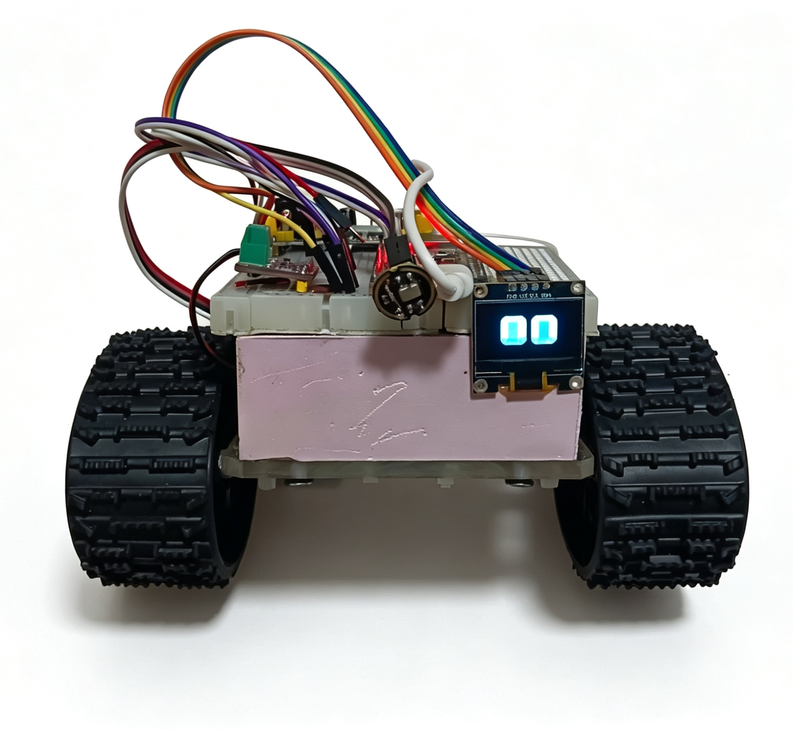

# ESP32 AI语音助手

## 项目介绍

**基于ESP32-S3开发的语音交互终端**

支持：

- 麦克风录音
- 语音识别
- 大语言模型问答
- TTS语音回复
- OLED表情显示

---

## 硬件

ESP32-S3-N16R8

INMP441

MAX98357A及配套喇叭

SSD1306 OLED 0.96寸

---

## 软件

Arduino

WebSocket

QwenAPI

---

## 项目状态

**正在扩展功能中...**

已经实现的功能：
    1. 智能语音交互
    接入QwenAPI，实现：
    -用户语音指令解析（ARS）
    -用户意图理解大语言模型文本交互
    -文本转语音（TTS）交互
    -支持自定义语音包
    2. 智能动作控制
    通过大模型返回结构化JSON返回预设指令，设备端解析动作编码并调用底层控制函数。
    -当前支持：前进、后退、原地左右转、停止
    3. 表情交互。
    设备端存储21种预设表情，边缘服务器接收大模型返回的表情编码并下发至片。设备端完成：
    -表情解析
    -OLED动画渲染
    -情绪联动显示

计划开发：

    软件架构:
        1. 移植FreeRTOS ；
        2. 优化任务调度模型；
        3. 调整动作与语音播放时序；
        4. 增加唤醒词交互模式。

    功能扩展：
        1. 集成MQTT；
        2. 扩展环境感知，并实现主动交互；
        3. 集成NEC红外协议，控制家具。
